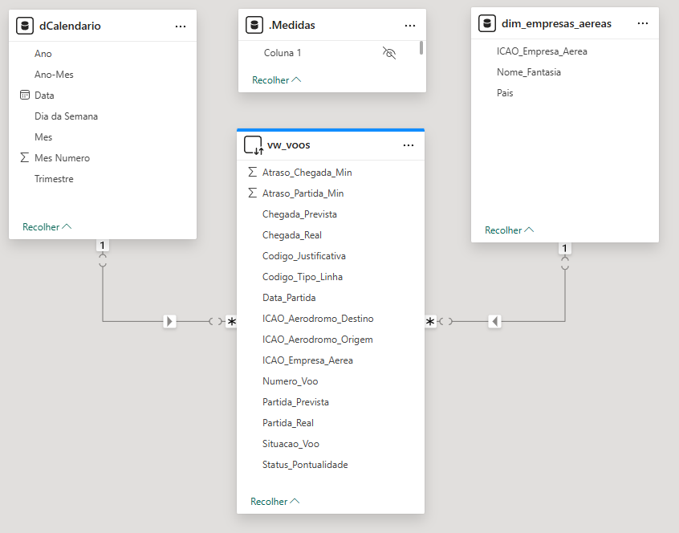
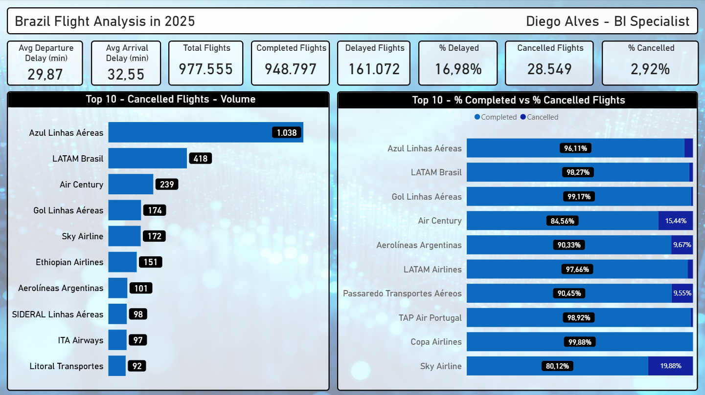

[Leia em Português](README.pt-br.md)

# Brazilian Aviation Punctuality Analysis — 2025

Analysis of over 970,000 flights operated in Brazil in 2025, using open data from ANAC (Brazil's National Civil Aviation Agency). The project covers the full data pipeline: from raw CSV ingestion into SQL Server to an interactive Power BI dashboard.

---

## Objective

Identify punctuality patterns, cancellation rates, and delay behavior across Brazilian airlines, demonstrating that analyzing absolute numbers without context can lead to misleading conclusions.

---

## Data Source

- **Source:** ANAC — National Civil Aviation Agency of Brazil
- **Dataset:** VRA (Voo Regular Ativo) — Regular Active Flights
- **Period:** January to December 2025
- **Records:** ~977,000 flights
- **Download:** [gov.br/anac](https://www.gov.br/anac/pt-br/assuntos/dados-e-estatisticas/historico-de-voos)

---

## Tech Stack

| Tool | Usage |
|---|---|
| SQL Server Express | Data storage and transformation |
| T-SQL / Views | Data modeling and calculated columns |
| Power BI Desktop | Data modeling, DAX measures and dashboard |
| Power Query (M) | Calendar table and data type adjustments |

---

## Project Architecture

```
CSV Files (ANAC)
      ↓
SQL Server Express
  └── fato_voos (fact table — 977k rows)
  └── vw_voos (view with calculated columns)
      ↓
Power BI Desktop (DirectQuery)
  ├── dim_empresas_aereas (airline dimension)
  ├── dCalendario (calendar table — Power Query)
  └── _Medidas (DAX measures table)
```

---

## Data Model



---

## Key DAX Measures

```dax
Total Voos = COUNTROWS(vw_voos)

Total Cancelados =
CALCULATE([Total Voos], vw_voos[Situacao_Voo] = "CANCELADO")

% Cancelados =
DIVIDE([Total Cancelados], [Total Voos], 0)

Total Atrasados =
CALCULATE(
    [Total Voos],
    vw_voos[Status_Pontualidade] = "Atrasado",
    vw_voos[Situacao_Voo] = "REALIZADO"
)

% Atrasados =
DIVIDE([Total Atrasados], [Total Realizados], 0)
```

---

## Dashboard Preview



---

## Key Insights

- Azul Linhas Aéreas leads in absolute cancellations (1,038), but has a cancellation rate below 4%
- Sky Airline, fifth in absolute cancellations, becomes first in cancellation rate with nearly 20%
- Average departure delay across all airlines: 29.87 minutes
- 16.98% of completed flights departed more than 15 minutes late (ANAC's official threshold)

---

## How to Reproduce

1. Download the VRA CSV files from the ANAC website (link above)
2. Create the database and table in SQL Server using the scripts in `/sql`
3. Run the BULK INSERT scripts to load all 12 monthly files
4. Execute the view creation script
5. Open the `.pbix` file in Power BI Desktop and update the SQL Server connection

---

## Author

**Diego Alves**
[LinkedIn](https://www.linkedin.com/in/diego-alvess)

---

## License

This project is for portfolio purposes. Data is publicly available from ANAC.
