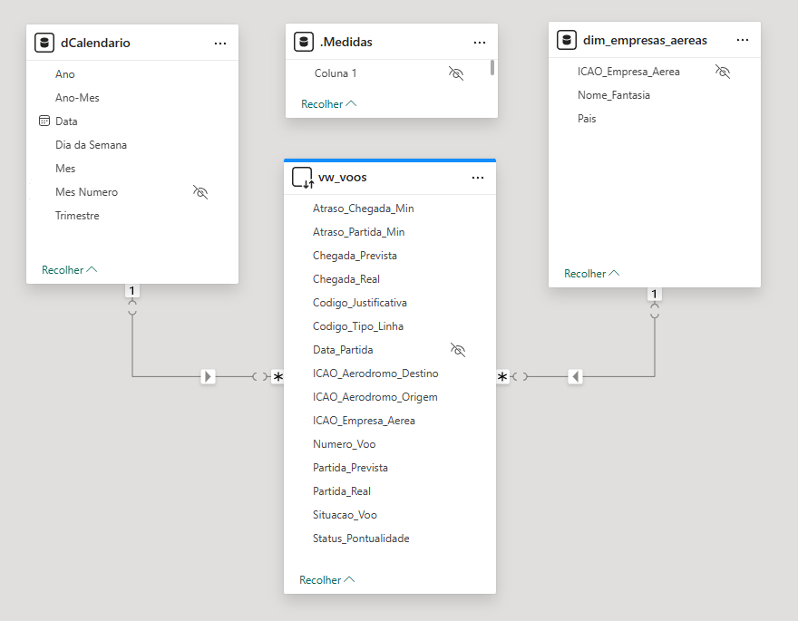
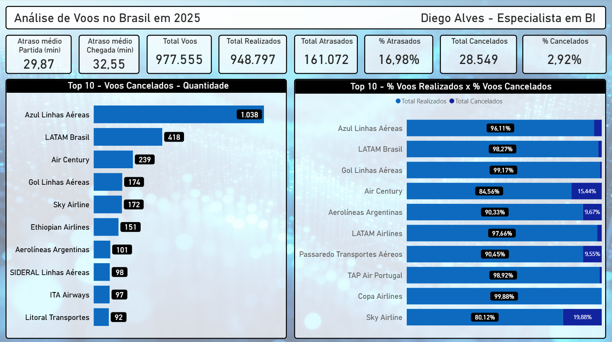

[Read in English](README.md)

# Análise de Pontualidade da Aviação Civil Brasileira — 2025

Análise de mais de 970 mil voos operados no Brasil em 2025, utilizando dados abertos da ANAC (Agência Nacional de Aviação Civil). O projeto cobre o pipeline completo de dados: da ingestão de arquivos CSV no SQL Server até um dashboard interativo no Power BI.

---

## Objetivo

Identificar padrões de pontualidade, taxas de cancelamento e comportamento de atrasos entre as companhias aéreas brasileiras, demonstrando que analisar números absolutos sem contexto pode levar a conclusões equivocadas.

---

## Fonte dos Dados

- **Fonte:** ANAC — Agência Nacional de Aviação Civil
- **Dataset:** VRA (Voo Regular Ativo)
- **Período:** Janeiro a Dezembro de 2025
- **Registros:** ~977 mil voos
- **Download:** [gov.br/anac](https://www.gov.br/anac/pt-br/assuntos/dados-e-estatisticas/historico-de-voos)

---

## Tecnologias Utilizadas

| Ferramenta | Uso |
|---|---|
| SQL Server Express | Armazenamento e transformação dos dados |
| T-SQL / Views | Modelagem e colunas calculadas |
| Power BI Desktop | Modelagem, medidas DAX e dashboard |
| Power Query (M) | Tabela calendário e ajustes de tipo |

---

## Arquitetura do Projeto

```
Arquivos CSV (ANAC)
      ↓
SQL Server Express
  └── fato_voos (tabela fato — 977k linhas)
  └── vw_voos (view com colunas calculadas)
      ↓
Power BI Desktop (DirectQuery)
  ├── dim_empresas_aereas (dimensão de companhias)
  ├── dCalendario (tabela calendário — Power Query)
  └── _Medidas (tabela de medidas DAX)
```

---

## Modelo de Dados



---

## Principais Medidas DAX

```dax
Total Voos = COUNTROWS(vw_voos)

Total Cancelados =
CALCULATE([Total Voos], vw_voos[Situacao_Voo] = "CANCELADO")

% Cancelados =
DIVIDE([Total Cancelados], [Total Voos], 0)

Total Atrasados =
CALCULATE(
    [Total Voos],
    vw_voos[Status_Pontualidade] = "Atrasado",
    vw_voos[Situacao_Voo] = "REALIZADO"
)

% Atrasados =
DIVIDE([Total Atrasados], [Total Realizados], 0)
```

---

## Preview do Dashboard



---

## Download

[Download arquivo Power BI (.pbix)](https://github.com/dgo-alves/brazil-flights-punctuality-2025/releases/download/v1.0/Brazil.Flight.Analysis.in.2025.pbix)

---

## Principais Insights

- A Azul Linhas Aéreas lidera em cancelamentos absolutos (1.038), mas tem taxa de cancelamento abaixo de 4%
- A Sky Airline, quinta no absoluto, se torna a primeira em percentual de cancelamentos com quase 20%
- Atraso médio de partida entre todas as companhias: 29,87 minutos
- 16,98% dos voos realizados partiram com mais de 15 minutos de atraso, que é o critério oficial da ANAC

---

##Como Reproduzir

1. Baixar os arquivos CSV do VRA no site da ANAC (link acima)
2. Criar o banco de dados e a tabela no SQL Server usando os scripts da pasta `/sql`
3. Executar os scripts de BULK INSERT para carregar os 12 arquivos mensais
4. Executar o script de criação da view
5. Abrir o arquivo `.pbix` no Power BI Desktop e atualizar a conexão com o SQL Server

---

## Autor

**Diego Alves**
[LinkedIn](https://www.linkedin.com/in/diego-alvess)

---

## Licença

Este projeto é para fins de portfólio. Os dados são públicos e disponibilizados pela ANAC.
